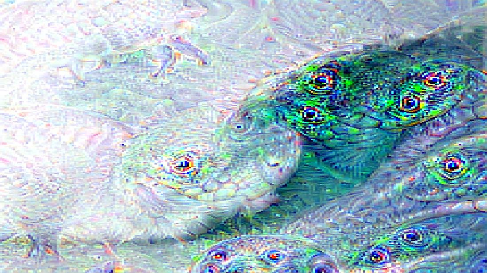
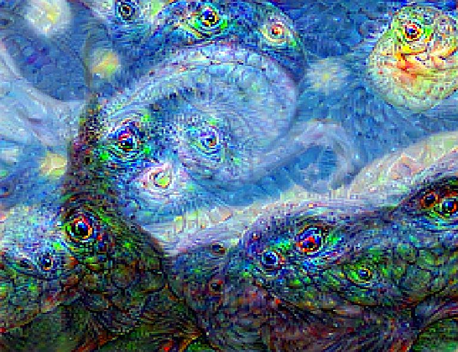

# deep-dream-in-pytorch
Pytorch (https://github.com/pytorch/pytorch) implementation of the deep dream (https://en.wikipedia.org/wiki/DeepDream) computer vision algorithm

## Installation

Install Jupyter notebook with Anaconda

http://jupyter.org/install

Run `jupyter notebook` and open [deep-dream-pytorch.ipynb](deep-dream-pytorch.ipynb)

Note: to improve performance set CUDA_ENABLED = True in the notebook if you have a capable Nvidia GPU.

## Examples

Cloud

DeepDream Cloud

Waves

DeepDream Waves

Starry Night

DeepDream Starry Night

[Fun video games with good AI](https://play.google.com/store/apps/dev?id=8454869713871668206)
-----------------------
-   [Tic Tac Toe](http://play.google.com/store/apps/details?id=com.popoko.gomokuvn)
-   [Chess](http://play.google.com/store/apps/details?id=com.popoko.chessru)
-   [Gomoku](http://play.google.com/store/apps/details?id=com.popoko.gomokukr)
-   [Minesweeper](http://play.google.com/store/apps/details?id=com.popoko.minesweeper)
