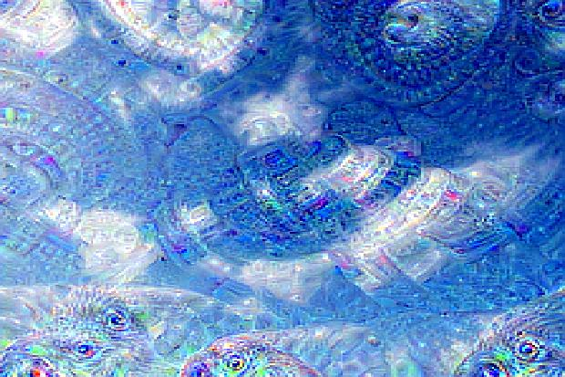

# deep-dream-in-pytorch
Pytorch (https://github.com/pytorch/pytorch) implementation of the deep dream (https://en.wikipedia.org/wiki/DeepDream) computer vision algorithm

## Installation

Install Jupyter notebook with Anaconda

http://jupyter.org/install

Run `jupyter notebook` and open [deep-dream-pytorch.ipynb](deep-dream-pytorch.ipynb)

## Examples

Cloud

Cloud_DeepDream

